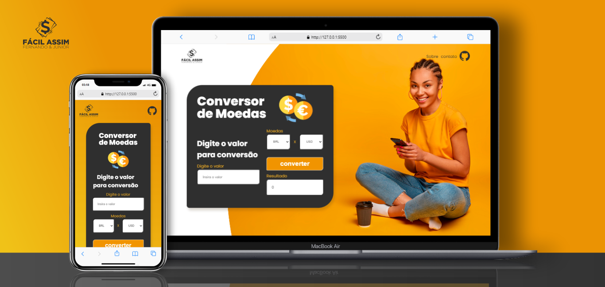

<h1 align="center"> CONVERSOR DE MOEDAS </h1>

Projeto iniciado com participação na Imersão Alura, um evento gratuito que está na sua 6ª edição.  

  <a href="#-tecnologias">Tecnologias</a>&nbsp;&nbsp;&nbsp;|&nbsp;&nbsp;&nbsp;
  <a href="#-projeto">Projeto</a>&nbsp;&nbsp;&nbsp;|&nbsp;&nbsp;&nbsp;
  <a href="#-layout">Layout</a>&nbsp;&nbsp;&nbsp;|&nbsp;&nbsp;&nbsp;
  <a href="#memo-licença">Licença</a>

  

 

  

    
  

 
 

 
🧑‍🚀 A idéia deste projeto foi inspirada no 1° dia da imersão AluraDev apresentado por Paulo Silveira, Rafaella ballerini e Guilherme Lima.  
 Foi desenvolvido com o que aprendi de html e css até o momento, em parceria com meu amigo Fernando Montanari que é aluno da ALURA, ficando responsável por implantar o JavaScript no código em uma PULL Resquest sobre a minha versão com dados alimentandos por uma API e interface de design moderno e fácil uso!
 
 Trata-se de uma empresa fictícia com logo e mockup de entrega desenvolvidos para este projeto, espero que todos os projetos daqui pra frente sejam desafiadores como este pois agora também sou aluno da ALURA ❤️‍🔥.

## 🚀 Tecnologias

Esse projeto está sendo desenvolvido com as seguintes tecnologias:

<li> HTML
<li> CSS
<li> JavaScript
<li> Git and GitHub
<li> Consumo de API

## 💻 Projeto

Nossa intenção é fazer com que o conversor de moedas lhe possibilite acessar on-line a cotação no momento atual e converter o valor desejado consumindo a API da <a href="https://www.exchangerate-api.com/">EXCHANGE RATE.</a>🚀

[Visite o projeto online](https://robertojunnior.github.io/conversor-de-moedas/)

## 🔖 Layout
🖼️ A imagem do background pertence a <a href="https://br.freepik.com/fotos-gratis/close-up-em-uma-jovem-atraente-e-despreocupada-sentada-no-chao_12950967.htm#query=pessoa%20telefone&position=9&from_view=keyword">wayhomestudio</a> no Freepik.

## :memo: Licença

Esse projeto está sob a licença MIT.

---

Feito by Roberto Junior & Fernando Montanari 😁:wave: 
 🧑‍🚀[Inscreva-se no canal do YouTube da Alura!](https://www.youtube.com/@Alura)

    
<h4> Obrigado por visitar meu Git e se chegou até aqui dê um "FOLLOW" que retribuo, quem sabe não podemos colaborar em algum projeto juntos?
   
   

 Até a próxima! 😁🖖.
