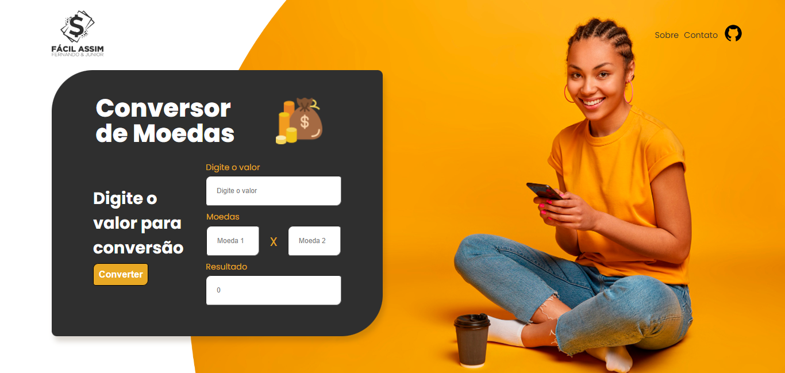

<h1 align="center"> CONVERSOR DE MOEDAS </h1>

Projeto iniciado com participação da Imersão Alura, um evento gratuito que está na sua 6ª edição.  

  <a href="#-tecnologias">Tecnologias</a>&nbsp;&nbsp;&nbsp;|&nbsp;&nbsp;&nbsp;
  <a href="#-projeto">Projeto</a>&nbsp;&nbsp;&nbsp;|&nbsp;&nbsp;&nbsp;
  <a href="#-layout">Layout</a>&nbsp;&nbsp;&nbsp;|&nbsp;&nbsp;&nbsp;
  <a href="#memo-licença">Licença</a>

  

 

  

    
  

 
 

 
🧑‍🚀 A idéia deste projeto foi apresentado por Paulo Silveira, Rafaella ballerini e Guilherme Silveira no 1° dias da imersão AluraDev. Não satisfeito rs, parei tudo que estava fazendo e estilizei com o que aprendi de CSS até hoje convidando meu amigo @FernandoMontanari(GitHub), que é aluno da ALURA para implementar a programação em JavaScript com inputs, alimentando os dados por uma API e uma interface de design moderno e fácil uso!

 

## 🚀 Tecnologias

Esse projeto está sendo desenvolvido com as seguintes tecnologias:

<li> HTML
<li> CSS
<li> JavaScript
<li> Git and GitHub

## 💻 Projeto

Minha intenção é fazer com que o conversor de moedas lhe possibilite acessar on-line a cotação no momento atual e converter o valor desejado.
Como ainda estou iniciando nos estudos de JavaScript, provável que o prazo seja extendido para finalização.

[Visite o projeto online](https://robertojunnior.github.io/imersao-aluradev/)

## :memo: Licença

Esse projeto está sob a licença MIT.

---

Feito com ♥ by Roberto Junior 😁:wave: 
 🧑‍🚀[Inscreva-se no canal do YouTube da Alura!](https://www.youtube.com/@Alura)

    
<h4> Obrigado por visitar meu Git e se chegou até aqui dê um "FOLLOW" que retribuo, quem sabe não podemos colaborar em algum projeto juntos?
   
   

 Até a próxima! - Bye 😁🖖.
